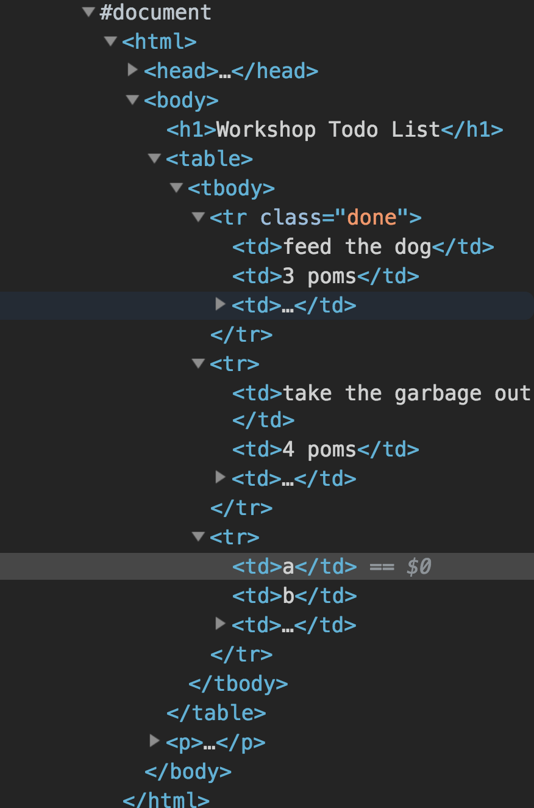
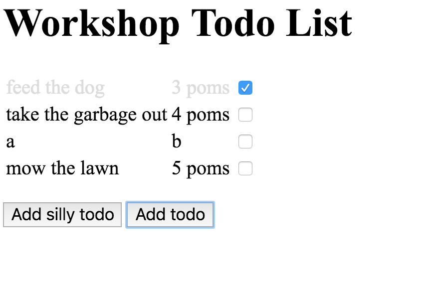

# codenow

## Code relating to weekend 1 - 2/16-18

Guys, I wanted to fill in some stuff that we *almost* got to, namely the
JavaScript.  If you recall, the last thing we got running was a script
that popped up (or rather, dropped down) a message when you clicked on
a checkbox.  You should still have this in your code on Cloud9 but anyway
here is what was involved:

1. In `index.html`, we added a checkbox in our table rows, with this line:

```
    <td><input type="checkbox" onclick="showmessage()"></td>
```
  
  (We didn't use the name `showmessage` but I can't remember what we used; anyway
  we can use whatever we want, as long as it matches the name in `index.js`.)
  
2. We added a file `index.js` that contained the following "function definition":

```
    function showmessage() {
       alert("Important message!");
    }
```

When we clicked on the checkbox, it "called" the `showmessage` function.  That
in turn called `alert`, which is a function built into JavaScript that pops up a message,
in this case containing `Important message`.  When the clickbox was clicked, the message
popped up:


So that's where we got to on Sunday; all of you got that working and it should be in your
Cloud9 files and also saved in your github repo.

The next step is trickier: we need to have the JavaScript code *make changes in the html*.
We'll do that next.  We want to do two things: (1) When we click on the checkbox in a row,
change the formatting of that row; I'm going to set the text color to gray.  This part we
started on but didn't finish.  (2) Add a new row to the table, i.e. a new todo.  We didn't
discuss that, but I've put it in here.

The github repo you're in now has, in addition to this `README` file, three files: `index.html`,
`index.css`, and `index.js`.  It contains code for both of the above features, and also an
intermediate feature, a simpler form of 2.  I'm going to explain each.

We'll mostly be looking at the JavaScript file `index.js`, so first let's go through the HTML and
CSS files; they don't contain anything you haven't seen, so this will be quick.

## Setup - HTML and CSS

For the HTML, I just wrote a simple table, just like the ones you already have.  Each row contains
the checkbox, with the attribute `onclick=markdone(this)`.  This is just like what we did on Sunday,
except for the word `this` inside the parens; I'll explain that below.  In addition, at the bottom
there are two buttons.

The buttons have an `onclick` action.  This works
just like the `onclick` for checkboxes: when the button is clicked, a function defined in `index.js`
is called.  These buttons add a new to-do to the table.  The first is "silly" - it just adds a
fixed to-do; it's there just to start things off.  The real "add to-do" button lets the user say
what the todo is and give a number of pomodoros.  Again, this is just like the checkbox, except the
onclick action doesn't have `this` in the call.

That's it for the html file.  The CSS file is super simple: it contains one ruleset, which gives
formatting associated with the `done` class.  If we were to add `class="done"` to a `td`, it would
set the text in that table item to light gray; if we added it to a `tr`, it would make all the text
in that table row light gray.  (Naturally, you can and should keep all the ruleset you already have;
I just left everything with no formatting to make the example as simple as possible.)

## Marking a to-do as done

So, to mark a to-do as done, we just need to add `class="done"` to the `tr` tag; that is, when we
click on the checkbox, the JavaScript function (`markdone`) needs to find the `tr` tag containing
this checkbox and add `class="done"`.

A specific occurrence of a tag in an html document is called a "node".  In `index.html`, there are
two `tr` nodes, and we need to find the one that contains the clicked node.  (When we get to adding
new to-dos, we will be adding more `tr` nodes; like the current two, each will have three `td` nodes
within it, and the third of these `td` nodes will have a clickbox.)

The `onclick` attribute says `onclick=markdone(this)`, which means, "when this box is clicked, call
the `markdone` function, and pass this clickbox as an argument."  Just like a mathematical function
like sin or square-root has an argument, JavaScript functions also have them.  The `markdone` function
will look for a `tr` node containing a clickbox node somewhere within it, but it can't do anything unless
we tell it which clickbox node we're talking about.  In an HTML tag, `this` refers to that node.

Let's look at the `markdone` function in `index.js`.  It has divided the work into two steps, each of
which is accomplished by calling built-in JavaScript functions:

```
function markdone(cb) {
   var row = cb.closest("tr");
   row.classList.toggle("done");
}
```

`cb` is the name used in the function to refer to its argument.  When `markdone` is called from the
html, it passes `this` - i.e. the clickbox node - as the argument; `markdone` refers to that by the
name `cb` (for "clickbox").  (We can choose any name we want, but it should be a name that is
somewhat descriptive of what the name refers to.)  The two steps in this function are:

1. Find the containing `tr` node.  We do this by calling the built-in function `closest`, which
looks at the parents and grandparents, and so on, of the `cb` node until it finds one that has
tag `tr`.  We call that node `row` (again, an arbitrary name that we've chosen descriptively).
(`closest` really has two arguments - the node it is starting from, in this case `cb`,
and the tag it is looking for, `"tr"`.  But instead of calling `closest(cb, "tr")`, we use this
"dot notation" for cb; it would unfortunately be too much for us to explain this distinction here;
all I can say is that if you look online at documentation for the various built-in functions, it is
always clear from examples how they are called.)

2. Now that we have the `tr` node, we want to add `class = "done"`.  We do that by using two more
built-in JavaScript functions: `row.classList` gives the class attribute of the `row` node (which in
this case is empty), and `toggle` says add the class `done` to that list.  (Actually, it "toggles" it;
if the row already has `class="done"`, it removes it.)

The todo list currently looks like this:


And here is how it looks after clicking in the first row:


Just one more thing:  Remember you can look inside the browser and see the details of each HTML
node.  Right-click on the first row of the html and select `inspect`.  You'll see a new pane
containing something like this:


Note that the first `tr` node has the `done` class, just as if we had entered it by hand in
the HTML.  The second one is just the way it was in the HTML, with no class attribute.

## Adding a new to-do

Adding a new to-do is not an action associated with a single row, but rather with the entire
page.  So we put the button for that separately, outside of the table.  When we click it, it
invokes a JavaScript function `addtodo`.  Thus, in the bottom of the HTML, we have:

```
<button onclick="addtodo()">Add todo</button>
```

Note that we don't use `addtodo(this)`, but just `addtodo`.  We don't need to tell the JavaScript
function which button we clicked (which is what `this` would be), because the place we want to
add the new row has nothing to do with this button.  Instead, the `addtodo` function will have to
somehow find the `table` node - there is only one on this page - and add to that.

We divided this task into two steps for ease of explanation.  First we'll look at `addsillytodo`,
which really isn't useful except for this explanation.  Then we'll look at `addtodo`, which is the
real thing.

### Finding the table and adding a row

Here is `addsillytodo`:

```
function addsillytodo() {
    var todolist = $("table");
    todolist.append('<tr><td>a</td><td>b</td><td><input type="checkbox" onclick="markdone(this)"></tr>');
}
```

Again, the first line of this finds a node that we need and gives it a name.  Here, the node is the
table itself.  There is only one table in this html, so we can just say "find the node with tag `table`";
JavaScript notation `$("table")` does just that.

Once we have that, we call the built-in `append` function, which says "add this bunch of html inside the
`todolist` node, i.e. inside the table.  The "bunch of html" looks exactly like the table rows that are
already in the table, but with nonsense task "a" and pomodoro count "b".

Click on `add silly todo` and the page will look like this:


Inspecting the html, we see:



*Subtle point*: You'll note in the new html we added, we used both single and double quotes: single
quotes around the whole thing and double quotes in the places where all our table rows have double
quotes.  In JavaScript, single and double quotes are equivalent and either can be used, but single
quotes only match with single quotes and double quotes only with double quotes.  If we had written
the html with only double quotes:

```
"<tr><td>a</td><td>b</td><td><input type="checkbox" onclick="markdone(this)"></tr>"
```

we would have a problem:  the double quote following `type=` would match the double quote at the
beginning of the line, and the `checkbox` would just be hanging there not quoted at all.  Using
single quotes on the outside solves this: the only match for the single quote at the start of the
line is the single quote at the end of the line, and everything within is included just as is.
(If for some reason we also needed to have a single quote *inside* the text, we would have another
problem, but luckily that doesn't happen here.)

### Adding a new to-do

The real to-do button adds a table row just like the silly one, but it asks the user what the to-do
is and how many pomodoros it needs.  We first need to use a built-in JavaScript function to get input
from the user.  Then we need to construct the HTML code that includes that user input.  The goal as
before is to make the HTML row look just like the existing rows.  Here is `addtodo`:

```
function addtodo() {
    var todo = prompt("what's the job, boss? ");
    var poms = prompt("how many pomodoros?");
    var todolist = $("table");
    todolist.append("<tr><td>" + todo + "</td>"
                    + "<td>" + poms + " poms </td>"
                    + '<td><input type="checkbox" onclick="markdone(this)"></tr>');
}
```

It is a lot longer than the silly one - that's why we did the silly one first.  The first two lines
use the JavaScript function `prompt` to get input from the user.  It will give the two prompts one at
a time.  When the `Add todo` button is clicked the first thing that happens is the drop-down dialog
shows up:


You can enter a task, and then it will pop up another dialog and you can enter a number.  These two
things will be given names `todo` and `poms`, respectively.  I entered "mow the lawn" and "5", so we
can think of `todo` as being the same as `"mow the lawn"` and `poms` as the same as `"5"`.  Now we
want to include those strings in a new row, again looking just like our existing rows.  The last
few lines are little hard to understand, but first let me show you the result:



Again, the whole job here is to create some HTML that looks like what we entered by hand.  The idea of
these last few lines is to construct that by putting together pieces of the HTML to form the entire
chunk.  The plus signs are what we used to put the chunks together; technically, `+` means "concatenate
strings".  Here, we're concatenating the following strings:

```
<tr><td>
mow the lawn  -- remember, todo is the same as "mow the lawn"
</td>
<td>
5             -- remember, poms is the same as "5"
 poms </td>   -- note the space at the start of this string
<td><input type="checkbox" onclick="markdone(this)"></tr>
```

Concatenating these all gives:

```
<tr><td>mow the lawn</td><td>5 poms </td><td><input type="checkbox" onclick="markdone(this)"></tr>
```

which is exactly what we want to add to the table.

# Wrapping up

Yeah, this is complicated.  There is a lot to learn about JavaScript notation and all the built-in
functions that do different things.  But hopefully you can see that there is a pretty straightforward
logic to what we're doing when we use JavaScript in web pages.

JavaScript is a *very* widely used language; pretty much every web page you visit has JavaScript
running in it, probably very complicated JavaScript.

But there is one thing that our JavaScript will
never do: remember the tasks we've added.  Whatever we add or mark as done is only added or marked
*in this HTML session*; if we close the window or just reload the page, it will all be lost.
That is because the JavaScript runs only in our browser - on the "client side", in internet lingo -
and never saves the data that are added.

In the second weekend, you will learn about how to overcome this very important shortcoming.  There,
you will write to code to run on the "server side."  It will be able to take the inputs - the text
we added for new tasks, the checkbox clicks - and remember them in a database "in the cloud."  That
way, the data will never be lost and can be accessed at any time from anywhere.
